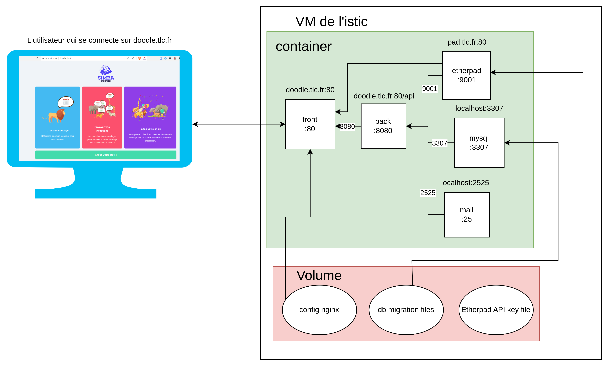

*Arnaud DELOURMEL*

*Tom ROUSSEAU*

# Projet TLC
Pour lancer le projet en local sur votre machine  utilisé la commande suivante :
```bash
docker compose up
```
Pour stopper le projet :
```bash
docker compose down
```

Modifier le fichier `host` en ajoutant les urls suivantes pour votre adresse local :

- tlc.doodle.fr
- pad.doodle.fr


Le projet est également accessible à l'ip : 148.60.11.223. Il nécessite également la modification du fichier `etc/hosts`

:warning: Nous avons remarqué que les machines virtuelles redémarrent de temps en temps. Par conséquent, il est possible que la version actuellement sur le serveur ne fonctionne pas.

#### Difficultés rencontrés

L'une des plus grandes difficultés a été liée à nginx-bunkerized. Initialement, nous souhaitions utiliser cette solution, mais nous avons rencontré de nombreux problèmes. Tout d'abord, nous avons constaté que nginx-bunkerized avait changé de propriétaire et était devenu privé, ce qui a empêché l'image de récupérer les fichiers de configuration nécessaires. Nous avons alors essayé avec bunkerweb, mais d'autres problèmes ont également entravé notre progression. Nous avons donc décidé de passer à une autre méthode en configurant nginx dans le conteneur du front. 

:information_source: Le docker-compose est aussi disponible il s'agit du fichier docker-compose.bunkerweb


#### Diagramme de déploiement

On retrouve ci-dessous le diagramme de déploiement de notre application :



## Deploiment continue

Nous avons aussi décidé de créer une pipeline d'intégration continue à l'aide de gitlab-ci. Vous pouvez retrouver le fichier de configuration de la pipeline à la racine de notre projet, mais aussi dans la partie "CI/CD" de gitlab. Cette pipeline va tout simplement exécuter le build ainsi que le deploiment de notre application à l'aide d'un job exécutant un `docker compose up -d`. Une autre partie de l'exercide de CI/CD a aussi été de créé notre propre runner shell dans notre VM. Le runner est configuré pour communiquer avec gitlab via une clé d'enregistrement unique, ce qui permet à gitlab de déléguer l'exécution de notre job à notre runner externe. Le runner va donc automatiser les processus de construction et de déploiement de notre application, tout en permettant un certain controle sur le processus d'exécution.

### Autres projets

Nous avons décidé d'utiliser nos compétences dans d'autres domaines que TLC. Pour le projet PIT, nous avons choisi de containeriser notre application. Vous pouvez trouver le projet sur GitLab à l'adresse suivante : https://gitlab.istic.univ-rennes1.fr/pompiers/pit_back/-/tree/develop/docker. Le Dockerfile est spécialement conçu pour le développement et non pour la production. Nous avons créé un docker-compose.builder pour exécuter la commande "npm i" et un docker-compose pour lancer l'application avec nodemon (pour le hot-reload). Cette méthode nous évite d'avoir à réinstaller les dépendances avant chaque exécution. Nous utilisons un makefile pour exécuter les commandes Docker. 
Nous avons aussi utilisé notre savoir concernant les deploiements continues à l'aide de gitlab-ci en ajoutant des pipelines de build, de tests, de lintage et enfin de deploiment dans le cadre de PIT. Vous pourrez retrouver la configuration de ces pipelines ici : https://gitlab.istic.univ-rennes1.fr/pompiers/PIT_Rasbery/-/blob/develop/.gitlab-ci.yml - https://gitlab.istic.univ-rennes1.fr/pompiers/pit_back/-/blob/develop/.gitlab-ci.yml.

Nous aimerions avoir votre avis sur l'aspect opérationnel de ce projet "pit-back" . N'hésitez pas à nous faire un petit retour sur Teams ou par mail :wink:
